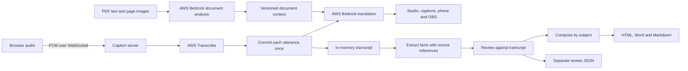
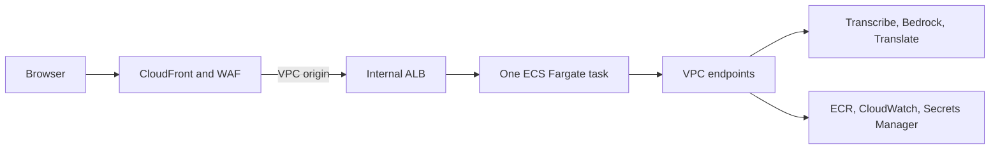

# Architecture

## Live interpretation

`routes_live.py` accepts 16 kHz PCM frames and `live.py` commits recognized phrases once. Translation uses the configured Bedrock model, with a faster model and Translate as fallbacks. Published captions are not rewritten when later context arrives.

PDFium extracts text and renders bounded page images in a child process; Pillow writes the JPEGs. The server sends each page's image and extracted text to Bedrock, then stores a reference note and page-specific observations. Every utterance uses a copy of the context revision active when it was received. A later page change does not alter an in-flight utterance.

Background analysis has bounded concurrency. AWS clients and connection pools are scoped to worker threads. Private rehearsal has its own input and output and does not append to the main record.

## Write-ups

`postprocess/writeup-policy.md` is the shared editorial policy. The application loads it at startup into the model's system instructions; the repository skill in `.agents/skills/session-writeup/` reads the same file. The skill adds a workflow for an agent using local files and the existing CLI. It is not a runtime dependency, and no MCP server is required.

`postprocess/editorial.py` divides long transcripts into bounded processing windows. These are not document headings. For each window it extracts substantive facts with source line indices and checks them against the same transcript.

The editor composes one document by subject. Decisions and follow-ups are rendered from verified fact fields and are omitted when empty. Uncertainty affecting a real decision or action remains visible. Recognition corrections and irrelevant fragments stay in a separate review file. The original transcript remains a separate, unchanged export.

The model can still misinterpret a source. Source references and the second pass provide traceability, not a guarantee of correctness.

All Word output goes through `postprocess/document.py`. It reads Markdown into an AST in Pandoc's IO sandbox, removes images and raw nodes, and writes DOCX in the sandbox. Input comes through stdin in a private working directory. It accepts no filters, templates, reference documents or input paths. Pandoc must include embedded data files; the container pins an official release and verifies its checksum. Bootstrap and image builds check sandboxed Word conversion before use. Transcript text is escaped before document formatting, while stored records remain unchanged.

## AWS deployment

`infra/app.py` creates a VPC with two isolated subnets by default, or uses explicitly supplied subnets in an existing VPC. The task has no public IP. AWS API traffic uses VPC endpoints. The attached internet gateway does not provide a subnet route to the internet.

The application runs one task because session state, documents and jobs are local to that task. Horizontal scaling, failover with state recovery and durable document storage are not implemented.

## Access and state

The operator controls audio, documents, corrections and exports. Attendees can receive captions and public presentation pages but cannot download session records or reference documents. One operator window controls the active input at a time.

Browser origins are checked for both authenticated and local requests. Unauthenticated mode requires a loopback bind and a loopback Host header. Access logs use route templates without queries or referrers; WAF request sampling is disabled in the deployment template.

The record keeps every committed utterance with its status and two times: when speech was committed and when the caption was shown. Utterances whose translation failed or was skipped stay in the full record with that status; write-ups leave out the skipped ones. PDF uploads return immediately and render in the background, one at a time, so a large PDF does not depend on one HTTP request staying open. A write-up runs only for the ended session it was requested for; when it exceeds its limit it stops before the next model call, and no new write-up starts until its worker thread has ended.

Pause and reconnect preserve session state. Preparing a new session clears materials, corrections and conversation. Restarting the server loses in-memory records and jobs. Browser preferences persist locally; session content does not.

The default inference profile IDs can route outside the configured AWS region. A regional endpoint alone does not guarantee in-region inference.
